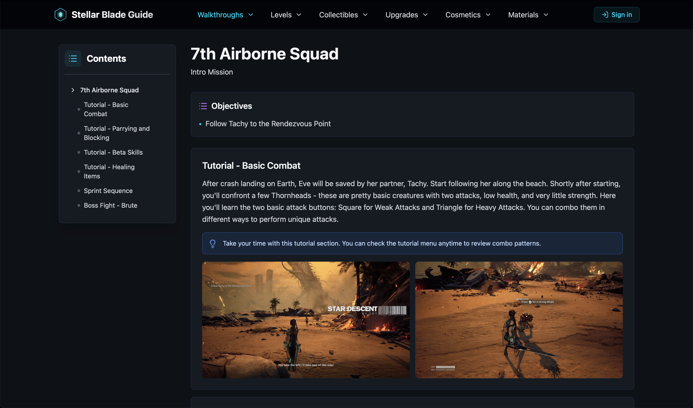
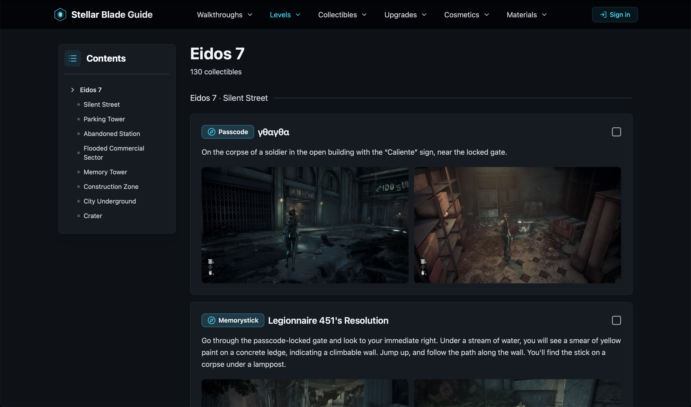
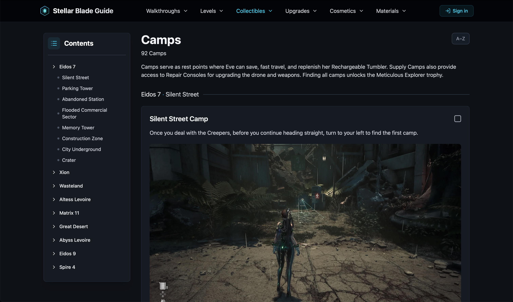

# Stellar Blade Guide

An unofficial game guide and collectibles tracker for *Stellar Blade*. Full-stack web application managing 800+ database records and 1000+ images via Cloudinary CDN.

**[Live Site](https://stellarbladeguide.com)** | **Tech Stack:** TypeScript, React, Python, FastAPI, PostgreSQL, Redis

**Key Features:** User authentication • OAuth (Google/Discord) • Threaded comments • AI content moderation • Redis caching • Cloudinary CDN • Image galleries • Responsive design


<details>
<summary><b>Built With</b></summary>

### Frontend
[](https://www.typescriptlang.org/)
[](https://react.dev/)
[](https://tailwindcss.com/)
[](https://tanstack.com/query/latest/docs/framework/react/installation)

### Backend
[](https://www.python.org/)
[](https://fastapi.tiangolo.com/)
[](https://www.sqlalchemy.org/)
[](https://pydantic-docs.helpmanual.io/)

### Database
[](https://www.postgresql.org/)
[](https://redis.io/)

</details>

## Table of Contents
- [Technical Details](#technical-details)
- [Screenshots](#screenshots)
- [Installation](#installation)
- [License](#license--legal)

## Technical Details

**Frontend**
- React 19 with TypeScript
- TanStack Query for data fetching, caching, and prefetching on hover
- Tailwind CSS for styling
- Image lightbox with zoom capability
- Skeleton loaders and smooth loading states
- Responsive design with mobile navigation drawer
- Protected routes with auth guards

**Backend**
- FastAPI with fully async endpoints
- JWT authentication with short-lived access tokens (15 min) and rotating refresh tokens (7 days) stored as HttpOnly cookies
- OAuth 2.0 integration with Google and Discord
- Password reset flow via email (Resend)
- SQLAlchemy ORM with async support
- Pydantic for request/response validation
- Role-based access control (user, moderator, admin)
- Rate limiting (slowapi) and custom honeypot middleware for bot detection
- CORS configuration
- AI-powered comment moderation via OpenAI Moderation API

**Database**
- PostgreSQL with relational schema
- Junction tables for many-to-many relationships
- Soft deletes for comments to preserve thread context
- Indexed queries for performance

**Performance & Caching**
- Multi-tier caching: Redis (server-side, 24hr TTL) + TanStack Query (client-side)
- Cloudinary CDN for image delivery and optimisation
- 60–70ms average API response times

**Auth & User System**
- Email/password registration and login
- OAuth sign-in with Google and Discord (avatar pulled from provider)
- Secure session management with refresh token rotation
- Account settings: username, avatar (uploaded to Cloudinary with AI moderation), password change, account deletion

**Comments**
- Threaded comments (one level of nesting) on walkthroughs, levels, and collectible pages
- Post, edit, and delete with ownership checks
- Moderator and admin controls
- AI moderation via OpenAI flags inappropriate content before it's saved
- Soft delete preserves thread context when a parent comment is removed

## Screenshots
<details>
<summary><b>View More Screenshots</b></summary>





</details>

## Installation

### Prerequisites

- Node.js 22+
- Python 3.13+
- PostgreSQL 17+
- Redis 8+

### Setup

#### 1. Install dependencies

Root (concurrently):
```bash
npm install
```

Client:
```bash
cd client && npm install
```

Server - using [uv](https://github.com/astral-sh/uv) (recommended):
```bash
cd server && uv sync
```

Or with standard Python venv:
```bash
cd server
python3 -m venv .venv
source .venv/bin/activate
pip install -r requirements.txt
```

#### 2. Environment Variables

Create a `.env` file in `server/`:
```bash
ENVIRONMENT=development
DATABASE_URL=postgresql+asyncpg://localhost:5432/stellarblade
REDIS_URL=redis://localhost:6379
CORS_ORIGINS=http://localhost:3000,https://stellarbladeguide.com

CLOUDINARY_CLOUD_NAME=your_cloud_name
CLOUDINARY_API_KEY=your_api_key
CLOUDINARY_API_SECRET=your_api_secret
CACHE_TTL=300

JWT_SECRET_KEY=your_jwt_secret # Generate using: openssl rand -hex 32
ADMIN_SECRET=your_admin_secret # Generate using: openssl rand -hex 32
FRONTEND_URL=http://localhost:3000

OPENAI_API_KEY=your_openai_api_key
RESEND_API_KEY=your_resend_api_key

GOOGLE_CLIENT_ID=your_google_client_id
GOOGLE_CLIENT_SECRET=your_google_client_secret
DISCORD_CLIENT_ID=your_discord_client_id
DISCORD_CLIENT_SECRET=your_discord_client_secret

LOG_LEVEL=INFO
DEBUG=True
```

#### 3. Database
```bash
psql postgres
CREATE DATABASE stellarblade;
\q
```

Seed scripts are available in `server/scripts/db/` for reference, though seed data files are not included in this repository.

#### 4. Run

From the root directory, this starts both the FastAPI server (port 8000) and Vite dev server (port 3000) concurrently:
```bash
npm run dev
```

## License & Legal

[](https://opensource.org/licenses/MIT)

### Code License
This project is licensed under the [MIT License](LICENSE).

### Game Content
**Stellar Blade™** and all related content (screenshots, artwork, character names, locations, game mechanics) are © Shift Up Corporation and Sony Interactive Entertainment. This is an **unofficial fan-made guide** and is not affiliated with, endorsed by, or connected to the rights holders.

### Fair Use Statement
This project uses game content under fair use principles for educational, informational, and non-commercial purposes.