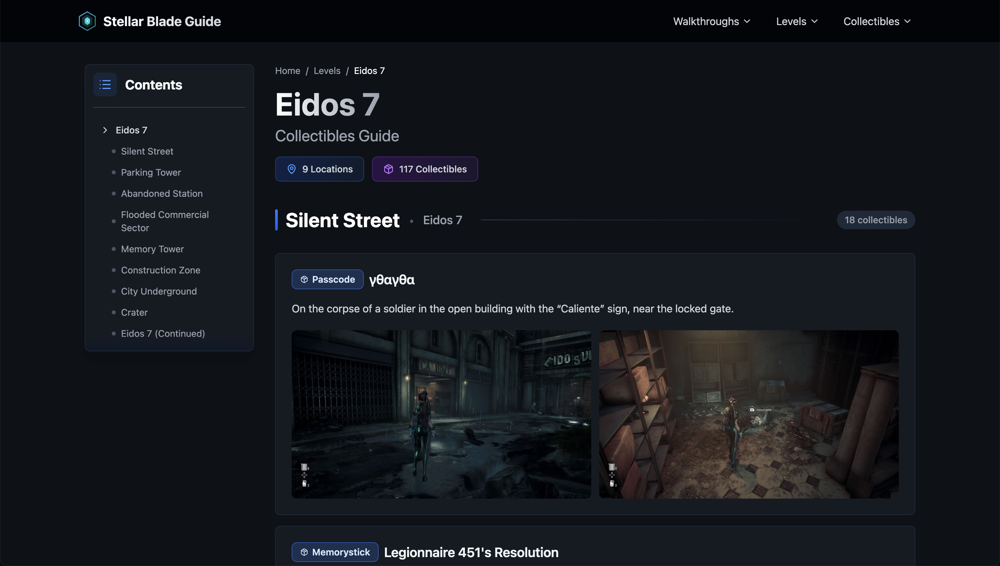
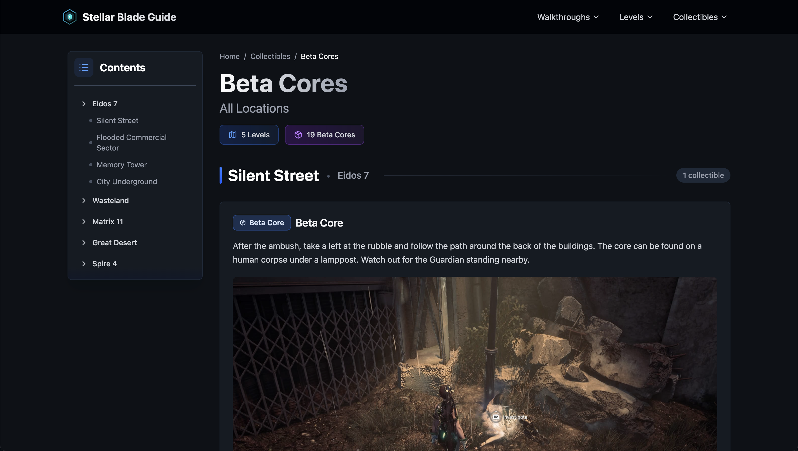

# Stellar Blade Guide

A game guide and collectibles tracker for *Stellar Blade*. Full-stack web application managing 800+ database records, and 1000+ images via Cloudinary CDN.

**[Live Site](https://stellarbladeguide.com)** | **Tech Stack:** TypeScript, React, Python, FastAPI, PostgreSQL, Redis

**Key Features:** Multi-tier Redis caching • Cloudinary CDN • Image galleries • Responsive design • Junction table queries


<details>
<summary><b>Built With</b></summary>

### Frontend
[](https://www.typescriptlang.org/)
[](https://react.dev/)
[](https://tailwindcss.com/)
[](https://tanstack.com/query/latest/docs/framework/react/installation)

### Backend
[](https://www.python.org/)
[](https://fastapi.tiangolo.com/)
[](https://www.sqlalchemy.org/)
[](https://pydantic-docs.helpmanual.io/)

### Database
[](https://www.postgresql.org/)
[](https://redis.io/)

</details>

## Table of Contents
- [Technical Details](#technical-details)
- [Screenshots](#screenshots)
- [Installation](#installation)
- [License](#license--legal)

## Technical Details

**Frontend**
- React with TypeScript
- TanStack Query for data fetching and caching with prefetching
- Tailwind CSS for styling
- Image lightbox with zoom capability
- Responsive design

**Backend**
- FastAPI with async endpoints
- SQLAlchemy ORM with async support
- Pydantic for request/response validation
- Rate limiting (100 requests/minute)
- CORS configuration

**Database**
- PostgreSQL with relational schema
- Junction tables for many-to-many relationships
- Indexed queries for performance

**Performance & Caching**
- Multi-tier Redis caching (10min/30min/60min TTLs)
- Cloudinary CDN for image delivery
- TanStack Query client-side caching

**Features**
- Browse 800+ collectibles by level and location
- Filter by collectible type
- Mission walkthroughs with objectives
- Image galleries with 1000+ images

## Screenshots
<details>
<summary><b>View More Screenshots</b></summary>





</details>

## Installation

### Prerequisites

- Node.js 18+
- Python 3.11+
- PostgreSQL 14+
- Redis 7+

### Backend Setup

Navigate to the `server/` directory.

#### 1. Virtual Environment & Dependencies
```bash
# Create and activate venv
python3 -m venv venv
source venv/bin/activate

# Install dependencies
pip install -r requirements.txt
```

#### 2. Environment Variables

Create a `.env` file in `server/`:
```bash
DATABASE_URL=postgresql://localhost:5432/stellarblade
REDIS_URL=redis://localhost:6379
CORS_ORIGINS=http://localhost:3000

CLOUDINARY_CLOUD_NAME=your_cloud_name
CLOUDINARY_API_KEY=your_api_key
CLOUDINARY_API_SECRET=your_api_secret

CACHE_TTL_SHORT=600
CACHE_TTL_MEDIUM=1800
CACHE_TTL_LONG=7200

ADMIN_SECRET=your_admin_secret
```

#### 3. Local Database

**Option 1: CLI**
```bash
psql postgres
CREATE DATABASE stellarblade;
\q
```

**Option 2: SQL File**

Create `db/schema.sql`:
```sql
DROP DATABASE IF EXISTS stellarblade;
CREATE DATABASE stellarblade;
```

Then run:
```bash
psql -d postgres -f db/schema.sql
```

#### 4. Seed Database
```bash
python3 scripts/db/seed_db.py
python3 scripts/db/seed_collectibles.py
python3 scripts/db/seed_walkthroughs.py
```

#### 5. Start Server
```bash
uvicorn main:app --reload
```

> **Note:** Reactivate venv in new terminal sessions:
> ```bash
> source venv/bin/activate
> ```

### Frontend Setup

Navigate to the `client/` directory:
```bash
npm install
npm run dev
```

## License & Legal

[](https://opensource.org/licenses/MIT)

### Code License
This project is licensed under the [MIT License](LICENSE).

### Game Content
**Stellar Blade™** and all related content (screenshots, artwork, character names, locations, game mechanics) are © Shift Up Corporation and Sony Interactive Entertainment. This is an **unofficial fan-made guide** and is not affiliated with, endorsed by, or connected to the rights holders.

### Fair Use Statement
This project uses game content under fair use principles for educational, informational, and non-commercial purposes.